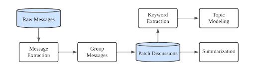

## Motivation and Goal

Open source runs a lot of the world's critical software systems, but they suffer from vulnerabilities that can lead to severe damage such as data breach, compromised system, financial loss, etc. Therefore, vulnerability assessment is needed. In addition, there is much that's unknown in how maintainers, developers and other parts of the software ecosystem function.

This project attempts to analyze code commits of open-source software repositories, that include both source code and patch conversations, to better understand them. We believe our project can help protect the health of OSS code and communities.

## Problem for the Semester

* Extract clean messages from the raw data from Linux Kernel Mailing List.
* Match each message to its maintainer group.
* Extract keywords from individual messages and patch discussions.
* Generate a summarization from each individual messages and patch discussions.

## State of the Art

We used certain delimiters and regular expressions to extract clean messages. To accomplish keyword extraction and summarization, we leveraged the power of large language models such as GPT4 and Llama2.

## Design and Approach

1) Write a parser to extract clean messages from the raw data. We use a small portion of the data to debug the parser.
2) Try out different large lanugae models on keyword extraction and summarization for a single message and evaluate their performance. For each task, we compare the model predictions with manually generated results and compute the precision, recall and f1 score.
4) Construct a pipeline(Python script) that takes in the raw data and outputs the clean messages, and extracted keywords and summarizations for each message.
5) Match each message with its maintainer group.
6) Implement functions to perform keyword extraction and summarization on a list of messages.

  

## Use Case Scenario

Maintainers of open source software can use our project to check for any malicious code submissions in patch discussions.

## Desired Outcomes and Benefits

Topic modeling: We will analyze the messages under each maintainer group and add labels to each of them. Malicious code commit can become more obvious when it doesn't match with the label of the maintainer group.
