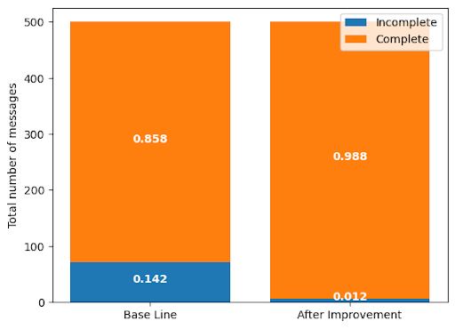
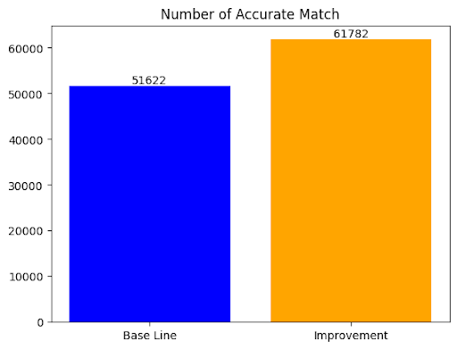
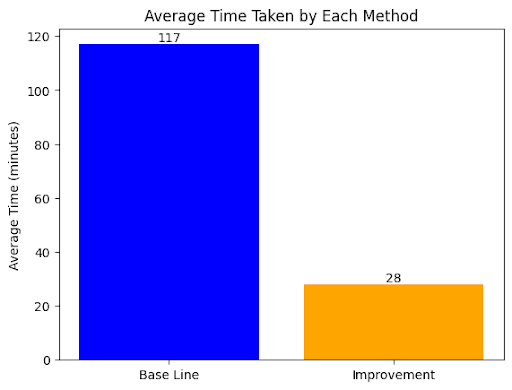
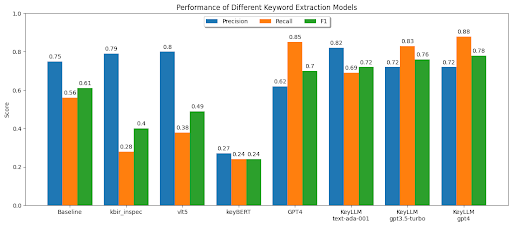
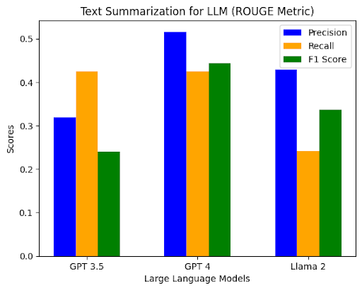

## System and Model Performance

  
  
Clean Message Extraction

   
  
  
Matching Each Message with Its Maintainer Group

   
  
  
Time Cost

   
  
  
Keyword Extraction

   
  
  
Text Summarization

## Discussion of Findings

1) Message Extraction: After the cleaning process, the message that contains incomplete content is reduced to 1.2%.
2) Message Matching: The accuracy of finding the correct matching of the maintainer group is increased by 16%.
3) Time Cost: The use of time to match 174242 messages was reduced from 117 minutes to 28 minutes by using a hash table to reduce repeated matching.
4) Keyword Extraction: Overall, KeyLLM with GPT4 has the highest performance. An interesting finding is that the models from hugging faces have high precision but low recall. This indicates they are able to recognize desired keywords but are incapable of extracting all of them.
5) Text Summarization: According to the results, GPT4 performs the best.

## Limitations and Future Work

The results show that GPT4 has excellent performance on both tasks. We will use it for topic modeling in the future. One limitation, however, is the cost of the model. With millions of messages on mailing lists, the cost of analyzing all of them can be huge. An alternative is Llama2, since it has good performance and is free to use.
